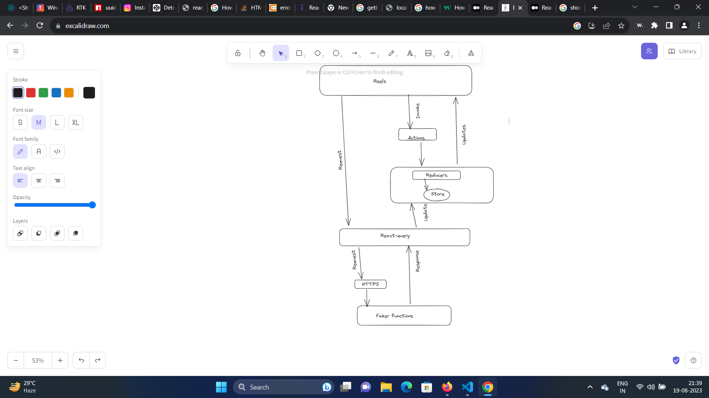

### Library Used
```
- react ---> For Rendering React Application
- react-dom  ---> For Rendering React Application
- react-query ---> For Data Fetching and Caching and Pagination
- react-icons ---> For Icons
- faker ---> For Showing Mock Data
```


### How the Application Will Interact?




### Folder Structure

```
| apis ---> For mimicing Http Request
| components ---> Reusable Components
    | [componentName] 
        ->index.js
        -> [component].jsx
        -> style.css
| contents ---> Contents For Modals
    | Comments ---> Modal Content for Comment
    | RelatedVideos ---> Modal Content for Related Videos
    | Shopping  ---> Modal Content for Related Products
| hooks ---> Reusable hooks functions 
    [hookName].js
| queries ---> Data Fetching and Data Caching and Pagination
    [query].js 
    queryClient  --> Singleton QueryClient
| reels ---> Main container to land
    --> reel

| store
    --> reducer.js ---> file for reducer and actions
    --> storeContext.js ---> Store Context 
| utils
    --> delay.js ---> delay function for mimicing http call
    --> utils.js ---> basic utility functions
-> App.jsx
-> index.js

```

### How Different Folders Will interact